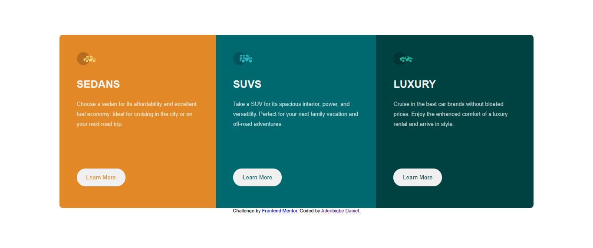

# Frontend Mentor - 3-column preview card component solution

This is a solution to the [3-column preview card component challenge on Frontend Mentor](https://www.frontendmentor.io/challenges/3column-preview-card-component-pH92eAR2-). Frontend Mentor challenges help you improve your coding skills by building realistic projects. 

## Table of contents

- [Overview](#overview)
  - [The challenge](#the-challenge)
  - [Screenshot](#screenshot)
  - [What I learned](#what-i-learned)
  - [Continued development](#continued-development)
- [Author](#author)

## Overview

### The challenge

Users should be able to:

- View the optimal layout depending on their device's screen size
- See hover states for interactive elements

### Screenshot

### Links

- Solution URL: [Solution URL](https://github.com/gb0ye/Front-End-Mentor-Projects/tree/a503e488b07335d8321e0c4d5177ce8f67f8bad9/3%20column%20preview%20card)
- Live Site URL: [Live Site](https://gb0ye.github.io/Front-End-Mentor-Projects/3%20column%20preview%20card/)

## My process

### Built with

- Semantic HTML5 markup
- CSS custom properties
- Flexbox
- Mobile-first workflow

### What I learned

I'm properly learning the use of the media query for making sites responsive. I have trouble grapsing the difference between the max-width and the min-width when using it with media query.

If you want more help with writing markdown, we'd recommend checking out [The Markdown Guide](https://www.markdownguide.org/) to learn more.

### Continued development

I plan on learning more about media queries, I think they're crucial for making sites responive. I also would look into writing less code but achieving more, I hope to reduce redundant code to the minimum.

## Author

- Website - [Add your name here](https://www.your-site.com)
- Frontend Mentor - [@yourusername](https://www.frontendmentor.io/profile/yourusername)
- Instagram - [@yourusername](https://www.twitter.com/yourusername)

